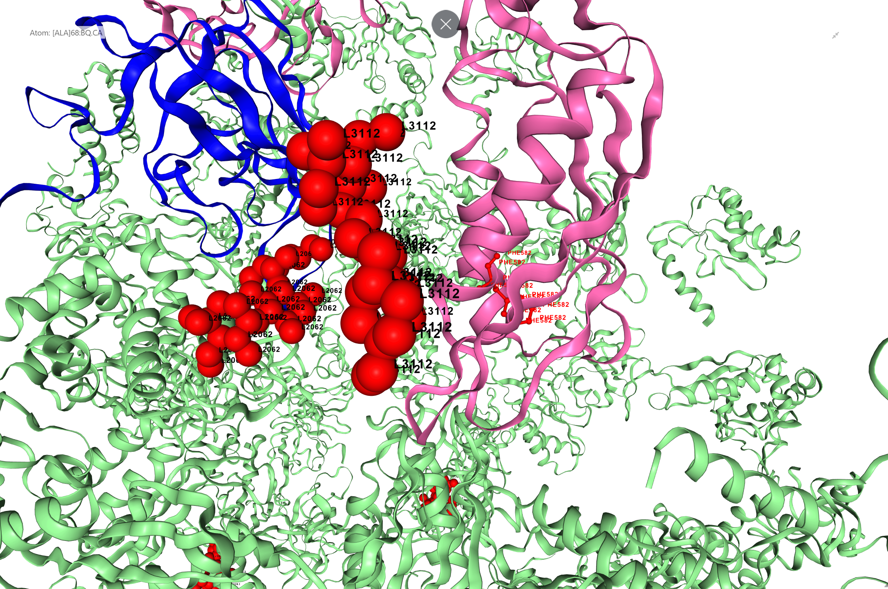

<p align="center"> 
  
</p>

<p align="center"><em>Structural overlay highlighting the Phe683Leu mutation in EF-G — visualising potential structural proximity to gentamicin binding site potentially linked to gentamicin resistance.</em></p>

# EF-G Mutations and Gentamicin Resistance in E. coli
*A reproducible Python workflow for structural analysis and mutation visualisation*

This repository contains part of my PhD research investigating the structural impact of mutations in the **elongation factor G (EF-G)** on bacterial susceptibility to gentamicin, using computational protein analysis.

## Background


A novel in vitro method was used to investigate the development of gentamicin resistance in Escherichia coli, Pseudomonas aeruginosa, and Klebsiella pneumoniae. This approach created a spatial gradient of increasing antibiotic concentrations, allowing bacteria to grow and adapt across zones of different drug exposure. As resistant subpopulations emerged, they could be isolated for further analysis.

DNA from gentamicin‑resistant colonies was sequenced, and the resulting data were aligned and annotated to detect genetic variants. Many resistant mutants carried substitutions in the fusA gene, which encodes elongation factor G (EF‑G) — a ribosomal GTPase essential for protein synthesis and a known target in antibiotic resistance studies.


## Objectives

This project showcases a Python-based workflow for protein structure visualization and mutation analysis:

- Generating EF-G variant structures using **AlphaFold 3**  
- Highlighting specific amino acid substitutions in predicted models  
- Superimposing EF-G variants onto the 70S ribosome with gentamicin  
- Visualising wild-type and mutant structures using **Biopython** and **NGL Viewer**  
- Structuring the codebase for modularity and reproducibility  


## Machine Learning Component

This workflow uses AlphaFold 3, a state-of-the-art deep learning model, as the machine learning component for structural prediction. EF-G FASTA sequences derived from WGS data were submitted to the AlphaFold server, and predicted models were used for structural comparison, confidence assessment, and mutation impact analysis within ribosomal complexes. 

## Disclaimer 

This repository was created independently by Razan to demonstrate technical expertise in computational biology, Python-based structural analysis, and reproducible workflow design. While the underlying biological study originates from her PhD research, the coding workflow, visualisation pipeline, and documentation presented here were developed separately for portfolio and educational purposes. Scientific questions and interpretations were guided by the original supervisory team.


## Scientific Workflows

### Workflow 1: AlphaFold EF-G Modeling & Comparison

- EF-G amino acid sequences were submitted to AlphaFold 3 for structure prediction.  
- Predicted models had confidence scores >88%, with most residues >90%.  
- Wild-type and mutant EF-G structures were visualized and superimposed using Biopython and NGL Viewer.  
- **RMSD between wild-type and mutant structures**:  
  - 0.52 Å for *E. coli 36099*  
  - 0.46 Å for *E. coli MG1655*  

**Findings:**  
- **Pro659** is located in EF-G Domain V, potentially influencing ribosomal translocation.  
- **Phe593Leu** in Domain IV is near the gentamicin binding site, suggesting a role in resistance.

### Workflow 2: EF-G + Ribosome Superimposition

- EF-G (post-translocational, 4V5F) was superimposed with the ribosome bound to gentamicin (PDB ID: 4V53).  
- **RMSD**: 0.7652 Å, confirming structural consistency.  
- Enables proximity-based visualisation of mutation effects within ribosome complexes.

## Repository Structure

```text
efg_gentamicin_resistance/
├── data/                      # CIF/PDB files, sequencing data
├── models/                    # Superimposed and AlphaFold-generated structures
├── notebooks/                 # Workflow notebooks (Workflow 1 & 2)
├── src/                       # Python scripts (bio_structures, visualise_structures, ribosome_drug_proximity)
├── figures/                   # Plots and structural images
├── efg_gentamicin_report.ipynb # Summary notebook
├── environment.yml            # Conda environment
├── conda                      # conda file
├── requirements.txt           # Pip dependencies (optional)
├── LICENSE                    # MIT License
└── README.md                  # Project overview
```

## Tools and Resources

- Python – protein extraction, superimposition, RMSD calculation

- Biopython – sequence parsing & structure manipulation

- AlphaFold 3 – protein structure prediction (AlphaFold server: https://alphafold.ebi.ac.uk/)

- NGL Viewer – 3D protein visualization

- Jupyter Notebook – workflow integration and reporting

- PDB Database – reference crystal structures

## Environment Setup

Recreate the Conda environment:

```bash
conda env create -f environment.yml
conda activate ef-g-resistance
```
Optional Pip installation:

```bash 
pip install -r requirements.txt
```

## How to Run

1- Launch Jupyter Notebook:
``` bash
jupyter notebook
```
2- Open notebooks in notebooks/ folder.

3- Ensure data/ contains CIF or PDB files.

4- Execute the cells to:

- Extract EF-G from ribosome structures

- Perform superimposition

- Calculate RMSD

- Visualize in 3D

5- Results:

- Superimposed structures → models/

- Figures & visualizations → figures/

### Skills Demonstrated

- Protein structure prediction with AlphaFold 3

- Structural alignment and RMSD calculation using Biopython

- Mutation visualization with NGL Viewer

- Reproducible workflow design with Conda and modular scripts

- Notebook-based scientific reporting


